# Лабораторная работа 3 - платформа для магазина

Делал в локальном `minikube`. Основной неймспейс - `lab-3`. 

## Часть 0

Сервисы написал на Go.

`api`:
- `POST /order` - создаёт заказ, инкрементит `shop_orders_created_total`;
- `GET /orders` - читает заказы;
- `GET /health`, `GET /metrics`.

Образы тегируются с префиксом `registry.local/shop/`, заливаются через `minikube image load`.

## Часть 1 - guardrails

### Почему Kyverno, а не Gatekeeper

Взял **Kyverno**. Сравнивал с OPA/Gatekeeper по четырём пунктам.

1. **Язык.** У Gatekeeper это Rego - отдельный язык с собственной моделью вычислений. У Kyverno политика - это YAML, в котором лежит образец желаемого манифеста. 
2. **Autogen.** Правило пишется на `kind: Pod`, а Kyverno сам достраивает его до Deployment, StatefulSet, DaemonSet, Job и CronJob (правила с префиксом `autogen-`). 
3. **Исключения.** `PolicyException` - отдельный объект API, который видно в `kubectl` и в git.

### Устройство набора

Шесть политик, по файлу на каждую. Исключения по неймспейсам собраны в одном месте - в [`values/kyverno.yaml`](values/kyverno.yaml).

### Правила

1. `require-workload-labels`** - обязательны `app.kubernetes.io/name`, `app.kubernetes.io/part-of` и `owner`.
2. `require-resource-requests-limits`** - обязательны `requests.cpu`, `requests.memory` и `limits.memory`.
3. `restrict-image-registries`** - только `registry.local/shop/*` и `ghcr.io/cloudnative-pg/*`.
4. `disallow-privileged-containers`** - запрещены `privileged`, `hostNetwork`, `hostPID`, `hostIPC`.
5. `require-explicit-image-tag`** - два правила: тег обязан быть (`image: "*:*"`) и не должен быть `latest` (`image: "!*:latest"`).
6. `require-health-probes`** - у каждого контейнера должны быть и readiness, и liveness.

### Проверка

Сначала офлайн, без кластера.

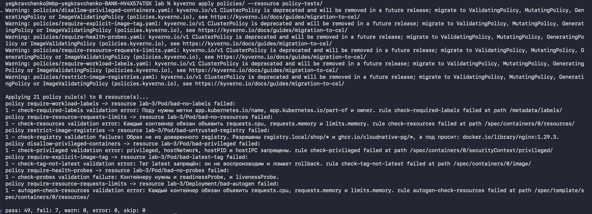

Потом на admission, через `kubectl apply`. Корректный манифест создаётся:

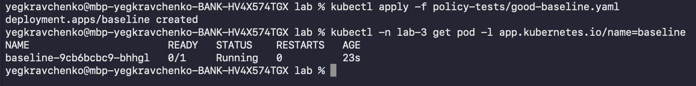

Все семь некорректных отклоняются:

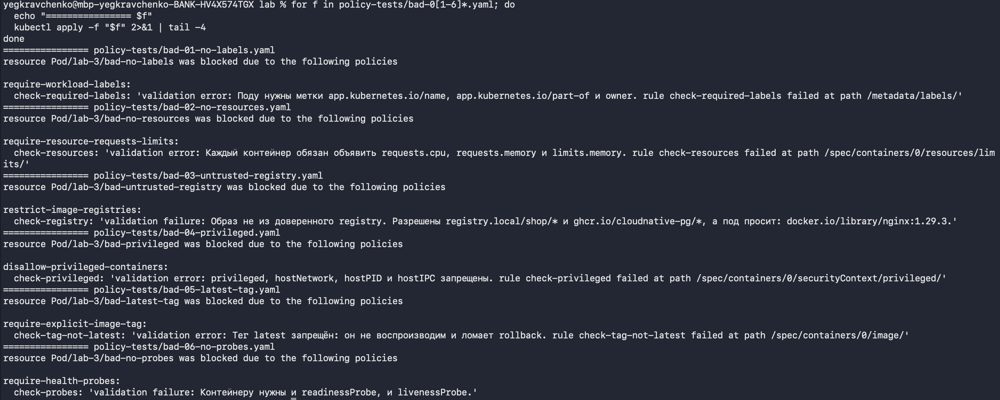

## Часть 2 - чарт

### Что показала реконсиляция

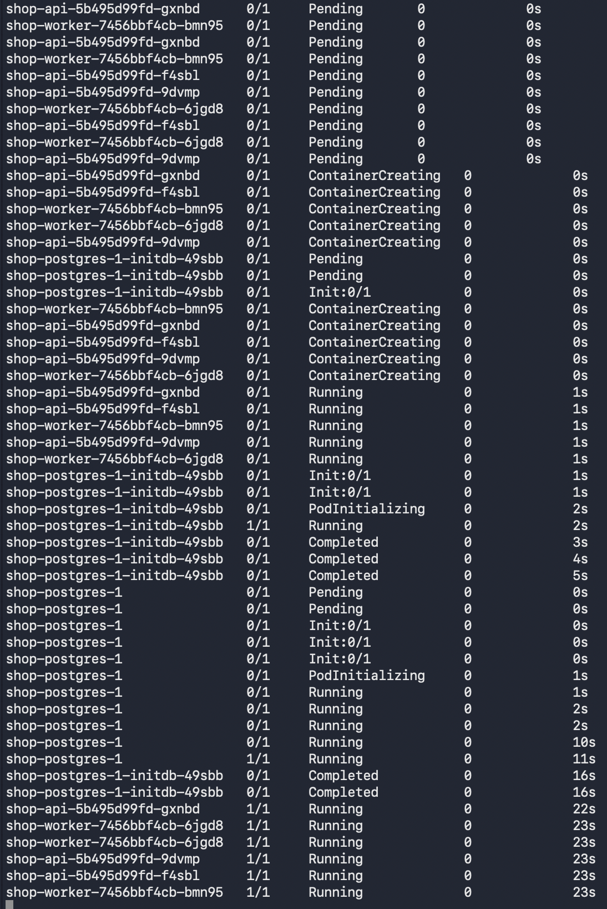

Дальше проверял по слоям:

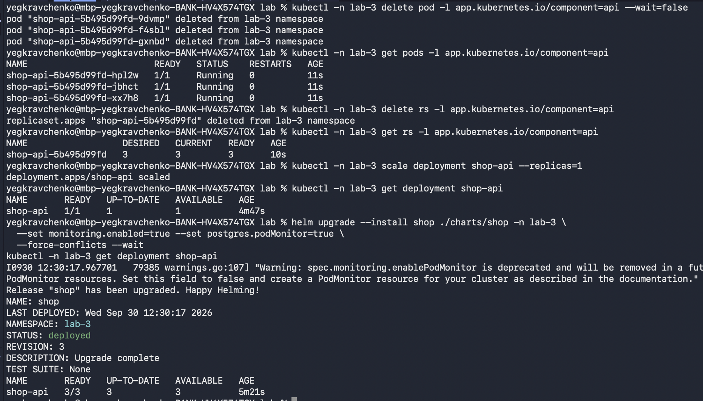

### Rolling update под нагрузкой

Нагрузку подавал изнутри кластера, с узла, по ClusterIP:

```bash
API_IP=$(kubectl -n lab-3 get svc shop-api -o jsonpath='{.spec.clusterIP}')
minikube ssh -- "while true; do curl -s -o /dev/null -w '%{http_code} ' http://$API_IP/health; sleep 0.2; done"
```

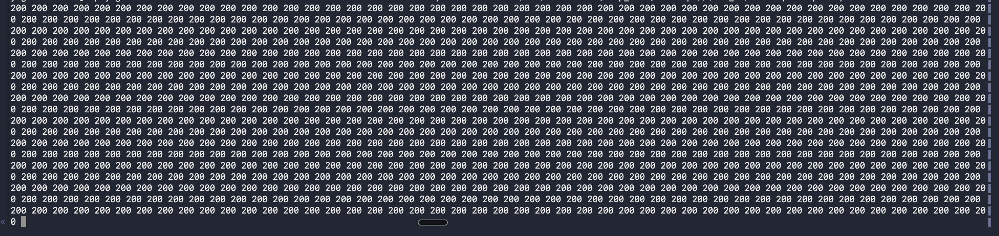

Выкатка `image.tag=0.1.0 → 0.2.0` прошла без единого кода, отличного от `200`. 
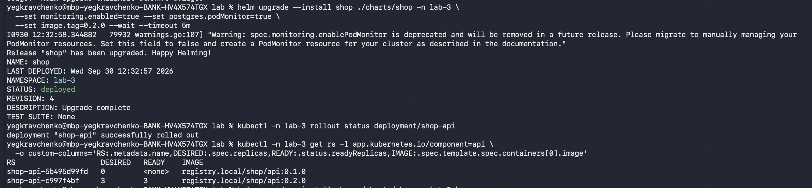

### Сломанный релиз и откат

Выкатил `--set api.healthFail=true`: `/health` начинает отвечать 503. Релиз не применился.

[Застрявшая выкатка](screenshots/7-rollout.png)

## Часть 3 - postgres через оператор

Взял **CloudNativePG**, оператор ставится в `cnpg-system`.

### Реконсиляция

Удалил под `shop-postgres-1` - оператор поднял замену и переприцепил тот же PVC, данные остались.

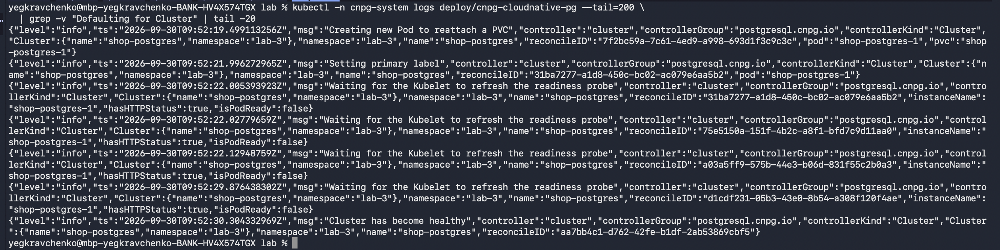

## Часть 4 - отказ control plane

Etcd и api-сервер в minikube - статические поды: kubelet поднимает их по манифестам из
`/etc/kubernetes/manifests` и следит за этим каталогом. Убрал манифест etcd - компонент остановился.

Через несколько секунд `kubectl` перестал работать вообще. 

**Что при этом продолжало работать:**

- Трафик в `shop`. Нагрузка с узла по ClusterIP всё время получала `200`. 
- DNS, балансировка, сам postgres - всё это тоже не ходит через control plane.
- Локальная реконсиляция на узле. Убил контейнер `api` через `crictl` - kubelet поднял его заново, из своей копии спеки пода. 

**Что сломалось:**

- Любое изменение желаемого состояния.
- Все контроллеры разом: kube-controller-manager, scheduler, оператор CloudNativePG, вебхук Kyverno. 
- Планирование новых подов: запланировать некуда и некому.

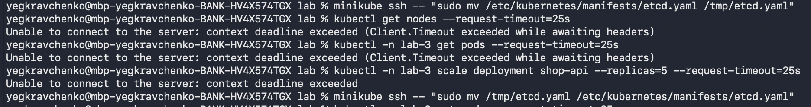

## Часть 5 - мониторинг

Стек переиспользован: `kube-prometheus-stack` установлен в `lab-2` с values из ветки `feature/lab-2` без правок. 

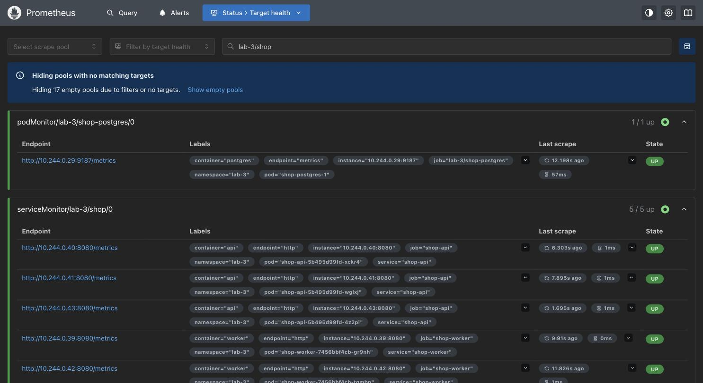

Дашборд:

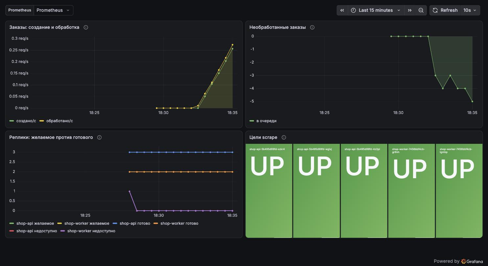

### Три алерта

**1. `ShopApiDown` - `up{job="shop-api"} == 0`, critical.**

**2. `ShopRolloutStuck` - `kube_deployment_status_replicas_unavailable{...} > 0`, warning.**

**3. `ShopOrdersNotProcessed` - заказы создаются, но `shop_orders_processed_total` не растёт, critical.**

### Срабатывание

Довёл до `firing` второй алерт: выкатил `--set api.healthFail=true` и оставил.

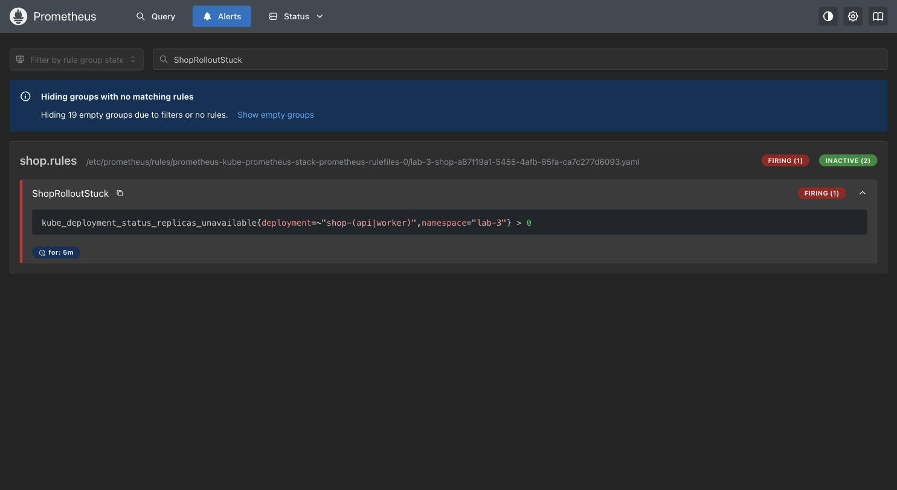

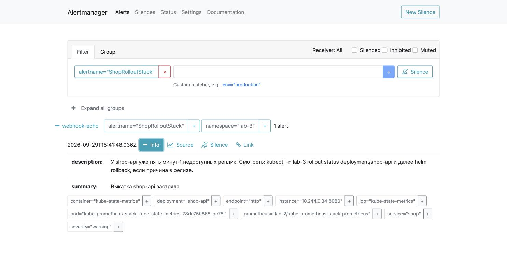

После `helm rollback` алерт ушёл в `resolved`.
