# Лабораторная работа 4 - SLA критического пути под перегрузкой

Делал в локальном `minikube`, неймспейс `lab-4`. Чарт - [`charts/shop`](charts/shop), стек мониторинга - `kube-prometheus-stack` в `monitoring`, guardrails Kyverno из лабораторной 3 без исключений для `shop`.

## Часть 0 - batch

[`shop/cmd/batch/main.go`](shop/cmd/batch/main.go): горутины крутят CPU, память растёт ступеньками до `BATCH_MEMORY_MIB` и держится вечно. Собирается тем же Dockerfile (`--build-arg SERVICE=batch`).

## Часть 1 - механизм разнесения

`spread.mechanism` в [`values.yaml`](charts/shop/values.yaml): `topologySpreadConstraints` или `podAntiAffinity`.

- `podAntiAffinity` - "не ставь рядом с таким же подом". `required` на 2 узлах и 3 репликах оставит третью в `Pending`, `preferred` - только пожелание, под нагрузкой его нарушат.
- `topologySpreadConstraints` - "разница числа подов между узлами не больше `maxSkew`".

Выбрал `topologySpreadConstraints` с `maxSkew: 1` и `DoNotSchedule`: это жёсткое правило, которое выполнимо при любом числе реплик (2+1, 4+4). `matchLabelKeys: [pod-template-hash]` - чтобы при rolling update старые поды не мешали считать перекос.

## Часть 2 - тесный кластер

Два узла. На драйвере `docker` каждый узел видит всю виртуалку Docker (12 CPU, 11.7 GiB), поэтому через `system-reserved` allocatable урезан до 3 CPU / 3.5 GiB, а `eviction-hard memory.available<8107Mi` включает вытеснение, когда working set узла переходит ~3.75 GiB.

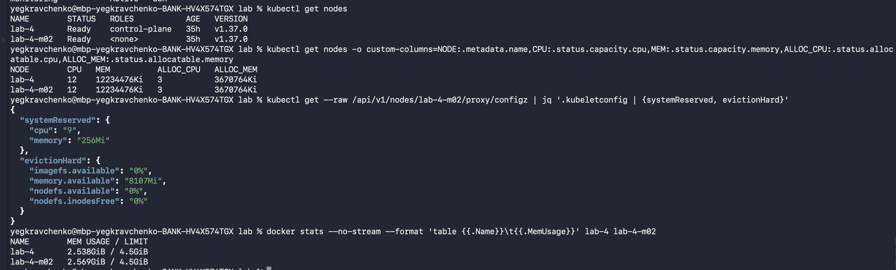

`batch` - новый шаблон [`batch-deployment.yaml`](charts/shop/templates/batch-deployment.yaml), установка с ресурсами "на глаз" из [`values/shop-initial-guess.yaml`](values/shop-initial-guess.yaml). Под без меток и limits Kyverno не пускает:

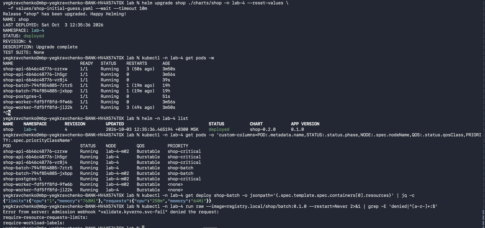

## Часть 3 - krr

Нагрузка k6 ([`load/order.js`](load/order.js), 30 заказов/с) из пода в кластере:

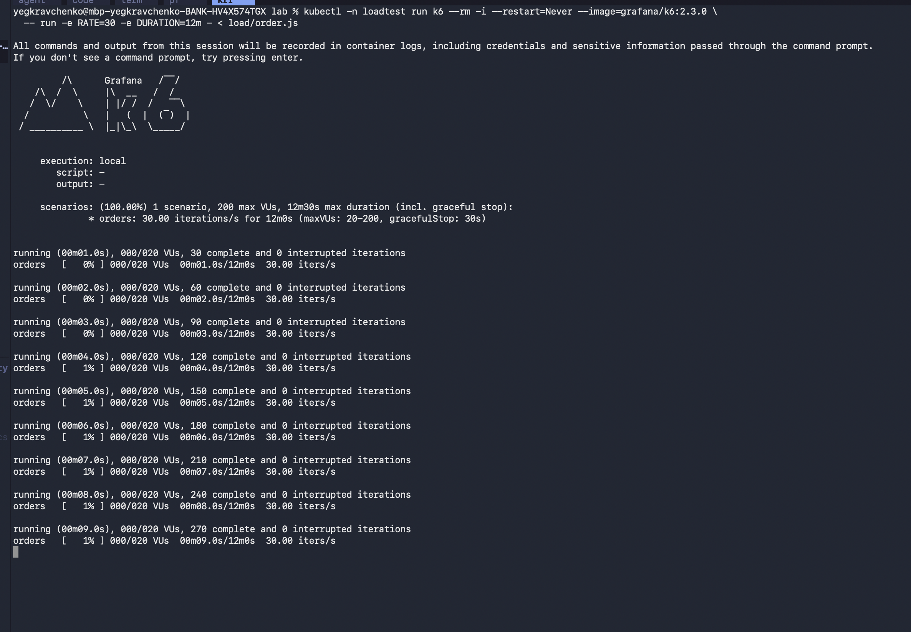

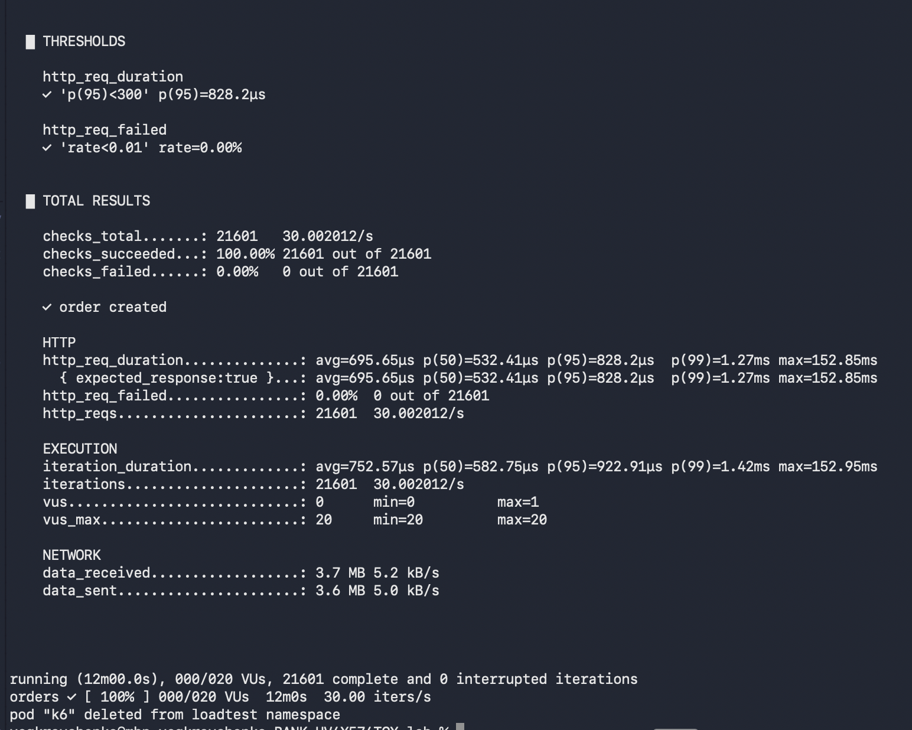

Отчёт `krr simple` ([`krr/report.txt`](krr/report.txt)):

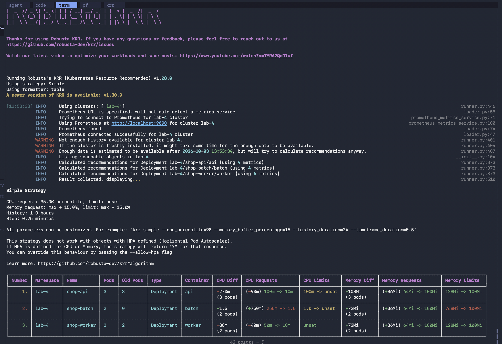

| | Догадка | krr | В `values.yaml` |
| --- | --- | --- | --- |
| api CPU | 100m, без limit | 10m, без limit | 100m = limit |
| api память | 64Mi / 128Mi | 100Mi / 100Mi | 100Mi = limit |
| worker CPU | 50m | 10m | 10m |
| worker память | 64Mi / 128Mi | 100Mi / 100Mi | 100Mi / 100Mi |
| postgres | 100m / 256Mi / 512Mi | нет в отчёте | 100m / 256Mi = limits |

**Почему разрыв.**

- Догадка завысила CPU в 5-10 раз: Go-сервис на 30 RPS почти не тратит CPU, и krr упирается в свои минимумы (10m, 100Mi).
- CPU api не взял из krr: krr советует request без limit, а для Guaranteed limit = request, то есть 10m стало бы жёстким потолком. Кроме того, при конкуренции за CPU доля пода пропорциональна request, и 10m против batch по 250m - это throttling и хвосты latency.
- postgres krr не видит: CloudNativePG создаёт поды напрямую из своего `Cluster`, без StatefulSet, а krr находит только Deployment/StatefulSet/DaemonSet/Job. Цифры взял руками: 256Mi покрывают `shared_buffers` (128MB), которые за час замера ещё не заполнились.
- batch оставил как есть - его ресурсы задаёт Часть 5, а не потребление.

## Часть 4 - разнесение api

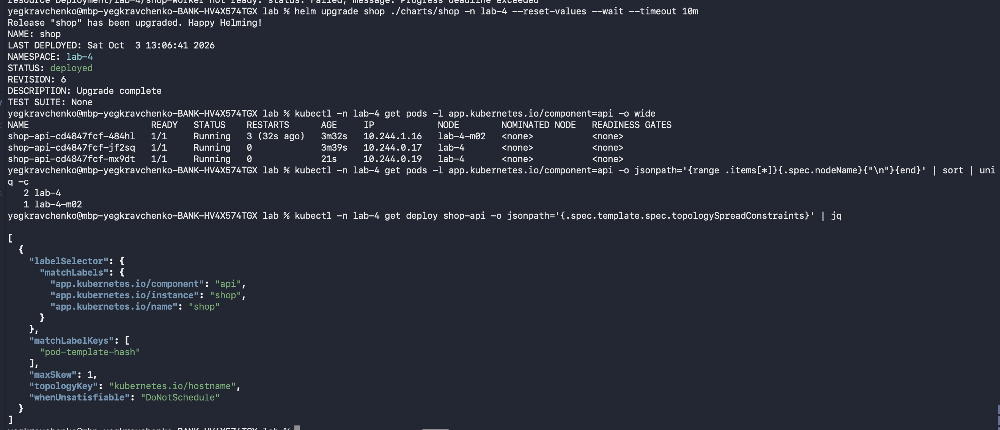

Реплики стоят 2+1 на разных узлах. Падение одного узла забирает не больше двух реплик из трёх, и PDB `minAvailable: 2` не даёт drain-у снять обе реплики с одного узла сразу.

## Часть 5 - приоритеты и гарантии

| | QoS | PriorityClass | PDB |
| --- | --- | --- | --- |
| api | Guaranteed | `shop-critical` 1000000, `PreemptLowerPriority` | `minAvailable: 2` |
| postgres | Guaranteed | `shop-critical` | `minAvailable: 1` |
| batch | Burstable (250m/64Mi, limits 1/768Mi) | `shop-batch` -100, `preemptionPolicy: Never` | нет |

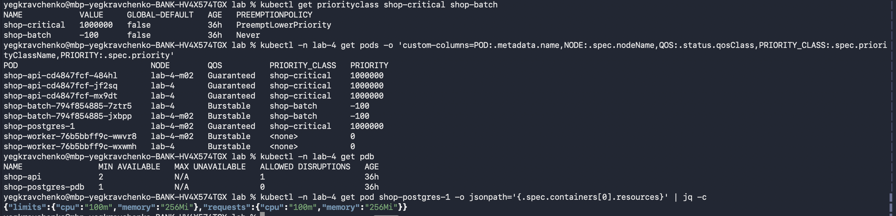

- **PriorityClass** - при нехватке места планировщик вытесняет поды с меньшим приоритетом. `Never` у batch: он никого не вытесняет.
- **Guaranteed** - под не превышает request, поэтому при давлении по памяти kubelet выбирает его последним.
- **PDB** - защищает от добровольных вытеснений (drain, обновление узлов), но не от вытеснения kubelet-ом при давлении.

**Burstable vs Guaranteed.** kubelet ранжирует жертвы так: сначала те, кто использует больше своего request, потом по приоритету, потом по размеру перерасхода. Burstable с маленьким request (batch: 64Mi при 700Mi потребления) попадает первым, Guaranteed по определению не может превысить request.

## Часть 6 - Pending и preemption

`--set batch.replicaCount=18`:

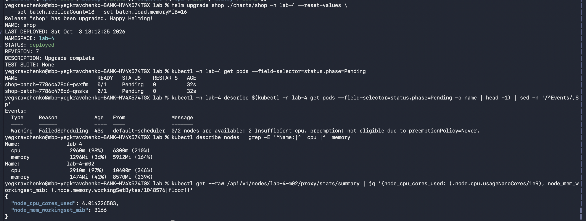

`Insufficient cpu`: планировщик считает зарезервированные requests (98% и 97% allocatable), а не реальное потребление. Вытеснять batch не может - `preemptionPolicy=Never`.

`--set api.replicaCount=8`:

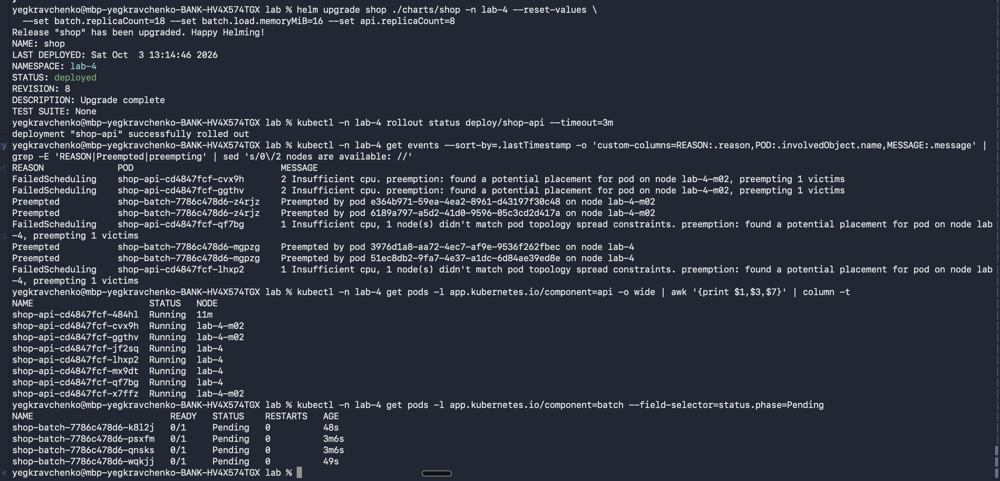

Новым подам api места тоже нет, но у них высокий приоритет: планировщик находит узел, вытесняет по одному поду batch (`Preempted`) и ставит api. Все 8 реплик `Running`, Pending остаются только batch.

## Часть 7 - eviction

`--set batch.replicaCount=4 --set batch.load.memoryMiB=700`. Каждый batch укладывается в свой limit 768Mi, но вместе они переполняют узел:

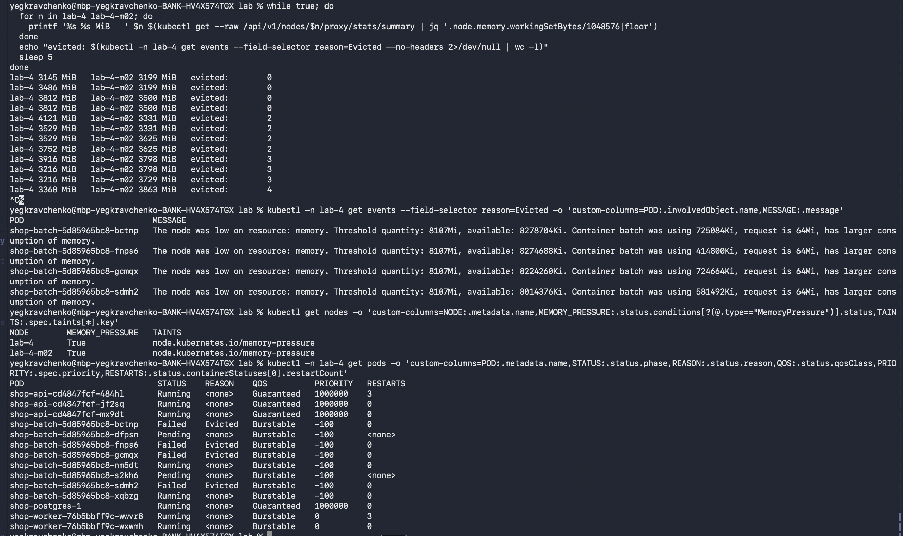

На обоих узлах `MemoryPressure=True`. Вытеснены только batch (`Evicted`, "request is 64Mi, has larger consumption"), api и postgres (Guaranteed) работают без новых рестартов.

Для сравнения - `OOMKilled`: один batch, которому велено держать 900 MiB при limit 768Mi:

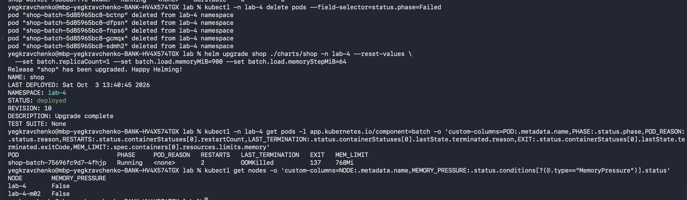

| | OOMKilled | Evicted |
| --- | --- | --- |
| Кто убивает | ядро, при превышении limit контейнера | kubelet, при нехватке памяти на узле |
| Что видно | контейнер перезапускается в том же поде, `lastState: OOMKilled`, exit 137 | под целиком `Failed`, `reason: Evicted`, создаётся новый под |
| QoS и приоритет | не важны | определяют порядок жертв |
| Что чинить | сам под: утечка или маленький limit | узел: переподписка по requests |

## Часть 8 - SLA

**SLA: 95% заказов быстрее 300ms и меньше 1% ошибок, даже под перегрузкой.**

k6 30 заказов/с 30 минут, параллельно Части 6-7:

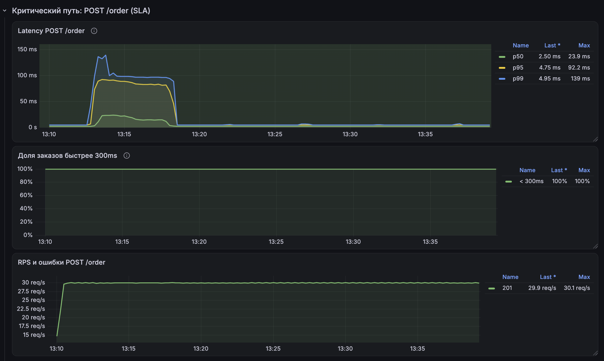

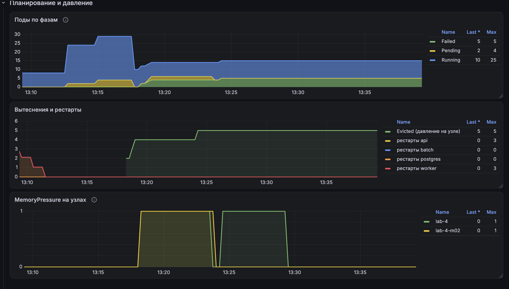

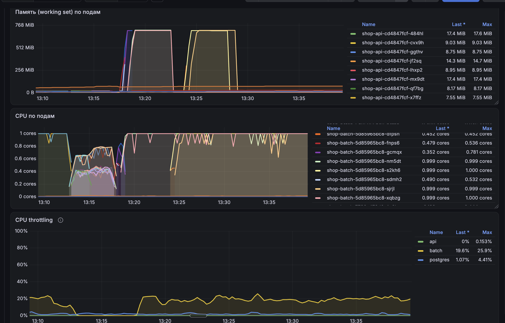

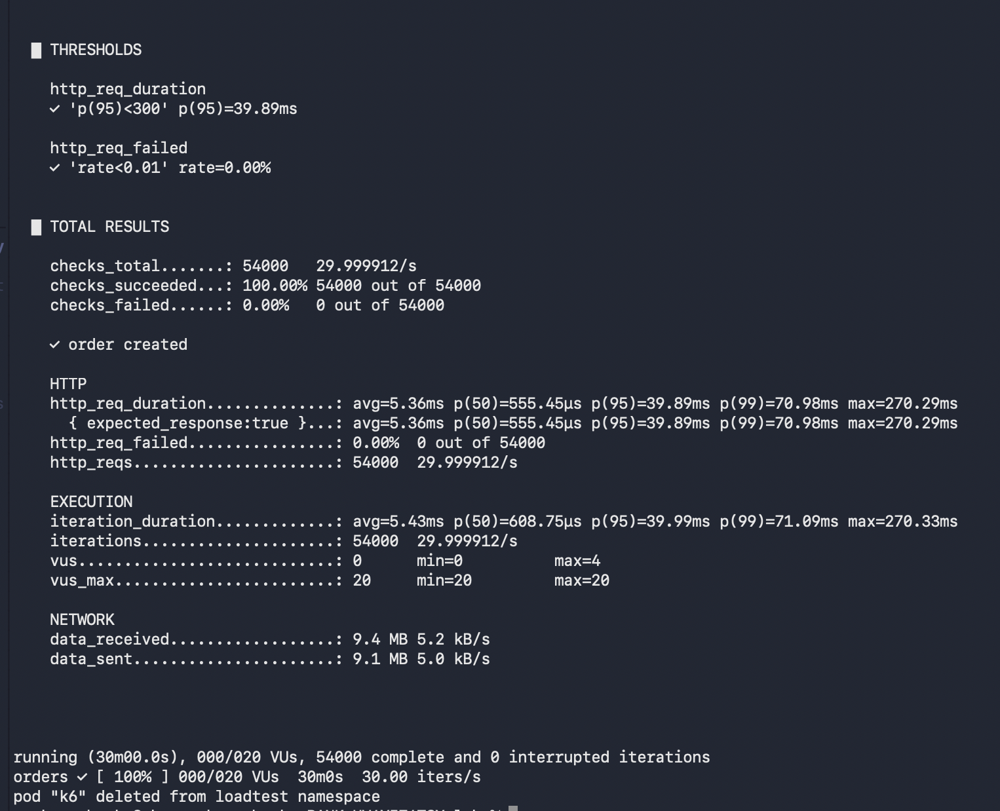

54000 заказов, 0 ошибок, p95 39.89ms, p99 70.98ms. Максимальный p95 на графике - 92ms во время preemption (13:13-13:18), 100% заказов быстрее 300ms всё время. Деградирует только batch: его вытесняют, держат в Pending и ограничивают по CPU (throttling ~20%), у api throttling 0%.

## Часть 9 - мониторинг

Шаблоны [`servicemonitor.yaml`](charts/shop/templates/servicemonitor.yaml) и [`prometheusrule.yaml`](charts/shop/templates/prometheusrule.yaml). Дашборд настроен вручную в Grafana - скриншоты 13-15 выше.

### Три алерта

1. **`ShopOrderLatencySLOBreach`** - p95 `POST /order` выше 300ms 5 минут, critical. Прямое нарушение SLA, то, что чувствует покупатель.
2. **`ShopCriticalPathPending`** - под api или postgres в `Pending` дольше 2 минут, critical. Preemption срабатывает за секунды, значит вытеснять больше некого и нужна ёмкость. Ловит причину до того, как пострадает SLA.
3. **`ShopNodeMemoryPressure`** - `MemoryPressure` на узле дольше минуты, warning. kubelet уже вытесняет поды, запас кончился.

### Срабатывание

Во время Части 7 сработал `ShopNodeMemoryPressure` на обоих узлах:

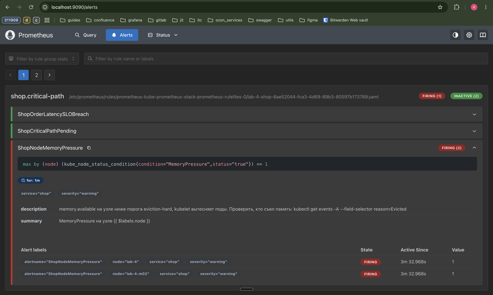

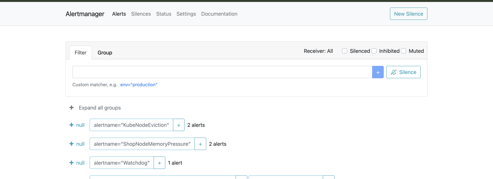
